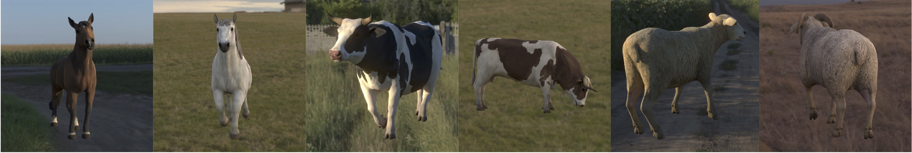

# Animodel - Benchmark for 3D Reconstruction of Animals

Published in *[Farm3D: Learning Articulated 3D Animals by Distilling 2D Diffusion](https://farm3d.github.io).*
[Tomas Jakab*](http://www.robots.ox.ac.uk/~tomj), [Ruining Li*](https://ruiningli.com/), Shangzhe Wu, Christian Rupprecht, Andrea Vedaldi. University of Oxford. In 3DV 2024. (* equal contribution)

Animodel is a synthetic benchmark designed for evaluating the quality of single-view 3D reconstructions of articulated animals. It consists of 3,000 realistic renderings of horses, cows, and sheep, each accompanied by a corresponding 3D mesh. The benchmark evaluates the quality of the reconstructions using the Chamfer Distance metric.




## Installation
Clone the repository and install the dependencies:
```
git clone https://github.com/example/animodel.git
cd animodel
```

Create a new conda environment and install the animodel package in it:
``` 
conda create -n animodel
conda activate animodel
pip install .
```


## Usage
### 1. Download data

Download test images and ground truth meshes from `http://www.robots.ox.ac.uk/~tomj/data/animodel-1.0.tar.gz` and extract them into a desired folder. E.g. `tar -xzvf animodel-1.0.tar.gz -C /your/path/to/animodel/data`.

The data are stored in the following structure:
```
├── animodel
    ├── <CATEGORY>
        ├── images
            ├── 000000.png
            ├── 000001.png
            ├── ...
        ├── meshes
            ├── 000000.obj
            ├── 000001.obj
            ├── ...
```
where `<CATEGORY>` is the category of the object: `horse`, `cow` or `sheep`. There are 1000 test samples for each category.


### 2. Predict 3D meshes for the test images
Use single-view to 3D reconstruction method of your choice to predict meshes for the test images. Save the predicted meshes as `.obj` files into their own directory.

**IMPORTANT:** The meshes should be stored with Y+ axis pointing upwards.


### 3. Run the evaluation
```python -m animodel.eval reconstructions_folder=<PATH_TO_RECONSTRUCTIONS> targets_folder=<PATH_TO_TARGETS> num_workers=<NUM_WORKERS>```

Arguments:
- `reconstructions_folder`: Path to the directory containing the predicted meshes.
- `targets_folder`: Path to the directory containing the ground truth meshes. E.g. `animodel/horse/meshes`.
- `num_workers`: Number of workers to use for parallel processing. If set to `0` or `1`, the script will run in a single-threaded mode.

Optional arguments:
- `out_folder`: Path to the directory where the results will be saved. It saves the caculated metrics and the aligned meshes. If not specified, the results will not be saved.

The evaluation script will calculate the Chamfer Distance between the predicted meshes and the ground truth meshes and print the results to the console. An example output is shown below:

```
Evaluation is complete.

Results
-------
In meters
        Mean Chamfer Distances
                Bidirectional: 0.075317 +- 0.009719
                Target to reconstruction: 0.081547 +- 0.012920
                Reconstruction to target: 0.069087 +- 0.006709


Scaled - target scaled to fit inside a unit cube
        Mean Chamfer Distances
                Bidirectional: 0.027800 +- 0.003585
                Target to reconstruction: 0.030108 +- 0.004868
                Reconstruction to target: 0.025492 +- 0.002308
```


## Details of the Evaluation
The evaluation script does the following:
1. Load reconstruction and target meshes.
2. Convert them into voxels to calculate volume of each.
3. Resize the reconstruction mesh to the target mesh based on the volume.
4. Remeshing reconstruction: Voxelize the resized reconstruction mesh.
5. Remeshing reconstruction: Remesh using marching cubes from the voxels.
6. Run ICP to align the reconstruction and target meshes.
7. Calculate the metrics - Chamfer Distance.
8. Rotate the reconstruction mesh by 180 degrees and repeat 7-8.
9. Pick the best alignment out of the two based on the lowest Chamfer Distance.
10. Save the results.
